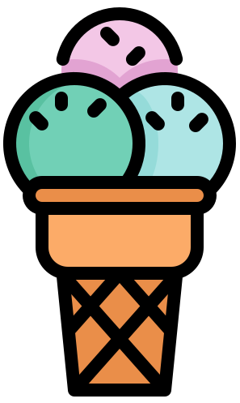
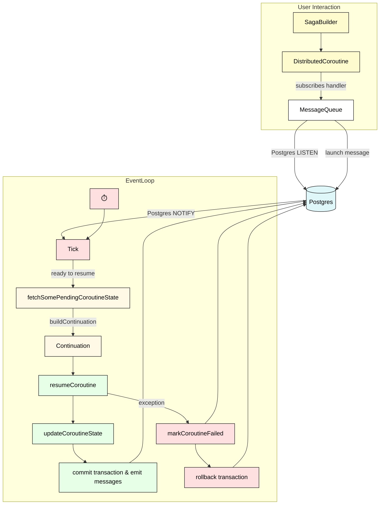

# Scoop



## Introduction

### What is this?
This repository introduces the concept of **structured cooperation** and provides a proof-of-concept implementation for distributed, message-based systems.
Structured cooperation is, essentially, an agreed-upon set of rules that components in a distributed system adhere to (one might therefore reasonably call it
a kind of *protocol*). These rules (it's really only one rule) are designed in such a way so that the resulting distributed system avoids many of the difficulties
traditionally associated with such systems—difficult to reason about, difficult to debug, difficult to manage errors and resources in, and only eventually consistent.

Scoop is an example implementation of these rules. It is written in Kotlin, and includes a custom messaging system built on PostgreSQL. However, the rules of
structured cooperation are completely general and do not require either of those technologies. Indeed, the primary purpose of this repository is to serve as a
template upon which many different implementations will be built, for different languages, frameworks, and infrastructure components.

### What problem does it solve?

If you already understand why distributed systems are a pain in the ass, you can skip this section.

Imagine you have a distributed message-based system with a component that creates *accounts* and *contracts* (a contract is linked to
an account) and emitting `ACCOUNT_CREATED` and `CONTRACT_CREATED` messages. Other components listen to those messages and update their databases
accordingly, perhaps also performing additional actions such as sending welcome e-mails, scheduling invoices, configuring access to support
portals, and so on.

There is, quite obviously, a clear order in which these things must happen—in general, actions corresponding to `ACCOUNT_CREATED` need to be done
before actions corresponding to `CONTRACT_CREATED`. For example, foreign key constraints in a relational database require the account to already be
there when persisting its contract. Scheduling invoices for a contract require us to know the invoicing e-mail, which is part of the account payload.
And welcome emails should probably only be sent once everything is actually ready—we don't want the customer to receive a welcome e-mail, only to
find out they can't access something.

In a distributed system, this is not trivial to do because the order in which messages are emitted is not necessarily the order in which
they are picked up. Even worse, it's not the pickup-time we're interested in, but rather the time that all corresponding handlers *finish
executing*—only that guarantees that we're actually ready to proceed.

Things get even worse when some part of the process results in an error. In normal code, we deal with these situations by "notifying the caller,"
e.g., by throwing an exception. In distributed systems, there's no concept of "distributed exceptions," in part because the code that emitted the
events has already finished running. This makes error handling challenging and debugging even more so—for instance, there's no concept of a stack-trace
that spans systems (which is why [tracing](https://en.wikipedia.org/wiki/Tracing_(software)) was invented). The same goes for resource management—there's
no `try-with` that spans systems. When I say "resources," think less "opening a file" and more" temporarily spinning up 100 servers."

All of the above can be, and is, solved in some fashion in existing distributed systems. However, the solutions are often ad-hoc, error-prone,
involve considerable complexity, and sometimes even require technologies of their own (such as [Jaeger](https://www.jaegertracing.io/)).

### How does it solve the problem?

Structured cooperation is a way to avoid these problems entirely. It does so by recognizing that the problems described above, along with many
others, are consequences of something the computer industry has already encountered, and solved, twice before. Once, around 1968, when [we started
thinking about the problems with GOTO](https://homepages.cwi.nl/~storm/teaching/reader/Dijkstra68.pdf), and then again more recently, around 2018, when
[the concept of structured concurrency started taking shape](https://vorpus.org/blog/notes-on-structured-concurrency-or-go-statement-considered-harmful/).

Structured cooperation takes its name from the latter and is the equivalent solution to the same problem in the context of distributed systems. As such,
it recovers the same properties recovered by implementing these solutions in the past and opens the doors to the same features, such as distributed exceptions,
stack traces, and resource handling.

The essence of structured cooperation is the following rule:

> A message handler can be broken down into consecutive steps. A step doesn't start executing until all handlers of all messages emitted in the previous
> step have finished.

That's pretty much it, although the power you get by adhering to this simple rule is pretty amazing. The "consecutive steps" part is usually called a
[saga](https://microservices.io/patterns/data/saga.html), and is already a well-established pattern.

Before browsing this repository, you should read the blog posts that introduce structured cooperation:

BLOG POST 1

BLOG POST 2

### How do I run it?
Currently, the only way to interact with the code is via tests, but you're free to play around with things and expose the functionality however you want.

To run the tests, make sure you have Docker installed (Quarkus uses [Testcontainers](https://testcontainers.com/)), then clone the repo and either run 
`./gradlew clean test`, or run the tests from IDEA.

Note that some tests may be flakey, because almost all of them involve some sort of sleeping to let the handlers finish their work. If that happens,
increase the corresponding `Thread.sleep()` in the failing test.

### How do I grok it?
Start by reading the blog posts above. Then, read the overview bellow and gain a high-level understanding of how Scoop is structured. Continue by
learning about how structured cooperation is implemented, along with the core of the messaging system works—coroutines, continuations, and the event loop.
Don't be discouraged by the fancy names; the code is heavily documented, and I promise I explain everything. Finally, learn about individual
functionalities—cooperation context, sleeping, deadlines, etc.

For the amount of punching power it packs, Scoop is actually relatively small and can probably be understood in an afternoon. Even though it uses
Quarkus and Kotlin, it does not use any terribly advanced features, and you should be able to make sense of the code without being versed in them. The only
real prerequisite is SQL, which is used quite heavily.

As always, AI is your friend here.

### Where can I ask questions?
Feel free to create an issue if you're unclear on something, and I'll do my best to explain. Ideally also search through issues to see if something similar wasn't
asked before. 

## Overview

### The state of Scoop
Scoop is currently a proof-of-concept implementation. That means that its design is best effort—it's not guaranteed to be bug-free, the architecture isn't
stellar, shortcuts were taken, there's raw SQL all over the place, tests are something of a mess, indices probably aren't correct, and I'm sure it's lacking in many
other areas.

The purpose of Scoop in its current form is not to be a top-notch production-ready library, nor is it supposed to win beauty contests or serve as a demonstration
of correctly architectured code. **The purpose of Scoop is to convey an idea.** As such, I did my best to keep abstraction to a minimum and be as straightforward as
possible. Incidentally, I also happen to hold the view that what my JVM brothers and sisters typically think of as 'proper architecture' often tends to be overengineered
intellectual masturbation devoid of any actual substance (\**ahem Spring ahem Hibernate ahem Jackson*\*), but that's another story.

That being said, I did try to build something that was *complete*. By that, I mean that I didn't knowingly skip any features that would be important for production usage.
I also took time to solve and document various obscure issues that arise when you try to use [Postgres for everything](https://postgresforeverything.com/) (which
I think you should, unless you have a good reason not to).

Message handlers (saga's) in Scoop are horizontally scalable out-of-the-box—that means you can spin up a single instance or 100, and everything should just work (until,
of course, it doesn't). Using Postgres for everything also allows Scoop to make strict transactional guarantees—a given transactional step of a saga will either complete
in its entirety, including emitting messages, or it will not.

Above and beyond that, Scoop supports cancellations, rollbacks (via compensating actions), timeouts (via deadlines), scheduling, periodic scheduling, and sleeping,
along with distributed exceptions, stack traces, and resource handling via a `try-finally` mechanism. Due to the way it's designed, many of these things are actually
emergent, and not fundamental primitives. It also implements its own
[context propagation](https://projectreactor.io/docs/core/release/reference/advancedFeatures/context.html) mechanism, which is a way of sharing contextual data
between different steps of a handler, or even across parent-child handlers. It is the equivalent of reactive context in reactive pipelines or `CoroutineContext`in
Kotlin Coroutines.

Scoop is implemented in two flavors, imperative and reactive. As you would expect, the latter is significantly more complicated, but including it should give
you everything you need to translate the principles of structured cooperation to pretty much any environment without needing to invest significant mental effort.

### Important components and high-level flow

As a hypothetical user, the main (and probably only) component you would interact with is `MessageQueue` and its implementation. Through this, you can launch a
message on the global scope (i.e. a toplevel emission) and subscribe handlers to topics. If you don't know what a *scope* is, read the blog posts linked above.

Handlers are implemented as instances of `DistributedCoroutine`, which consists of a list of `TransactionalSteps`.`SagaBuilder`provides a comfortable Kotlin
interface for building `DistributedCoroutine`instances, and can be seen used in practically every test.



When you subscribe a handler to a given topic, two things happen. One, Postgres
[LISTEN](https://www.postgresql.org/docs/current/sql-listen.html)/[NOTIFY](https://www.postgresql.org/docs/current/sql-notify.html) is used to subscribe to
new messages being published to the topic, two, a periodic process is started that repeatedly checks if any step of the coroutine is ready to be run,
called *resuming* a coroutine. In the simplest case, a coroutine can be resumed if the structured cooperation rule mentioned above holds, i.e., all handlers of
all messages emitted in the previous step (if any) have finished. Things get a little more complicated when you add errors, cancellations, and timeouts to the mix,
but essentially this is still what happens.

When a coroutine is ready to be resumed, its state (e.g., what step was last executed, if it resulted in a failure or not, if any messages emitted in the last step
resulted in failures or not, if a rollback is in progress or not, etc.) is pulled from the database, and combined with the list of steps in the coroutine definition
to produce an object which actually executes the code of the next step. This object is called a `Continuation`.

Once we build a `Continuation`, we resume it (resuming a coroutine and resuming a continuation can be used interchangeably), which runs the code associated with the
appropriate next step. We then persist some additional state back to the database and commit/rollback the transaction (depending on if an exception was thrown in
the process of executing the step). This also commits (or doesn't) any messages emitted during the step execution, and, once all handlers of those messages finish
executing, the same process repeats until all steps have been executed.

The component responsible for doing this process (fetching the state of a coroutine, building continuations, running them, updating the state) is called an `EventLoop`,
and the name of this process is a `tick` - i.e., a `tick` is doing all that, for a single coroutine.

Here's a simplified version of the above, which is pretty much what you will find in the actual code (see 
[EventLoop](src/main/kotlin/io/github/gabrielshanahan/scoop/reactive/coroutine/eventloop/EventLoop.kt))

```kotlin
class EventLoop {
    
    @Transactional
    fun tick(distributedCoroutine: DistributedCoroutine) {
        val state = fetchSomePendingCoroutineState()
        val continuation = distributedCoroutine.buildContinuation(state)
        try {
            val result = continuation.resume(state.lastStepResult)
            updateCoroutineState(distributedCoroutine, result)
        } catch (e: Exception) {
            // This happens in a separate transaction, otherwise it would also be rolled back
            markCoroutineFailedInSeparateTransaction(distributedCoroutine, e)
            // Rethrow exception to kill transaction
            throw e
        }
    }
}
```

### How structured cooperation is implemented
From a data perspective, Scoop consists of two tables: `message` and `message_events`. The former is used as an append-only message queue, and nothing
very interesting or surprising goes on there. The latter is also append-only, and is fundamentally what allows Scoop to adhere to the rules of structured
cooperation. We use it to track interesting events that happen with a handler—a message is emitted in a step, a rollback is initiated, a step finishes
executing, etc. Scoop then uses this data for three things:

1) To determine if a coroutine is ready to be resumed (i.e. if all handlers of all messages emitted in the previous step have finished)
2) To construct the state used to then build the continuation (see above)
3) To pass around various metadata, such as the cooperation context and what specific exceptions happened

Here is an example of what that looks like:

| id | message\_id | type | coroutine\_name | coroutine\_identifier | step | cooperation\_lineage | created\_at                       | exception | context |
| :--- | :--- | :--- | :--- | :--- | :--- | :--- |:----------------------------------| :--- | :--- |
| 01975f7d-b18b-702c-800b-c6f4915bdc7b | 01975f7d-b186-7061-80be-6d3fa3830aff | EMITTED | null | null | null | {01975f7d-b189-7ed4-8967-084233494b43} | 2025-06-11 19:56:02.443084 +00:00 | null | null |
| 01975f7d-b194-7070-80c2-c349700b7ee7 | 01975f7d-b186-7061-80be-6d3fa3830aff | SEEN | root-handler | 01975f7d-b150-7cb8-b0b9-432a326d7310 | null | {01975f7d-b189-7ed4-8967-084233494b43,01975f7d-b193-706e-80b8-c8a32166c8a0} | 2025-06-11 19:56:02.451659 +00:00 | null | null |
| 01975f7d-b1d1-70f6-80e5-b43980ce6ec8 | 01975f7d-b1ce-70ec-80b4-45faa6a01fd5 | EMITTED | root-handler | 01975f7d-b150-7cb8-b0b9-432a326d7310 | 0 | {01975f7d-b189-7ed4-8967-084233494b43,01975f7d-b193-706e-80b8-c8a32166c8a0} | 2025-06-11 19:56:02.513482 +00:00 | null | null |
| 01975f7d-b1d5-7021-80df-b66900c77d02 | 01975f7d-b186-7061-80be-6d3fa3830aff | SUSPENDED | root-handler | 01975f7d-b150-7cb8-b0b9-432a326d7310 | 0 | {01975f7d-b189-7ed4-8967-084233494b43,01975f7d-b193-706e-80b8-c8a32166c8a0} | 2025-06-11 19:56:02.517036 +00:00 | null | null |
| 01975f7d-b1da-709a-8033-71d3d7271294 | 01975f7d-b1ce-70ec-80b4-45faa6a01fd5 | SEEN | child-handler | 01975f7d-b16f-7fe7-a562-11bbbcddd139 | null | {01975f7d-b189-7ed4-8967-084233494b43,01975f7d-b193-706e-80b8-c8a32166c8a0,01975f7d-b1da-707f-80f6-bd14b073821c} | 2025-06-11 19:56:02.521856 +00:00 | null | null |
| 01975f7d-b251-7024-80c6-179da78ed022 | 01975f7d-b1ce-70ec-80b4-45faa6a01fd5 | SUSPENDED | child-handler | 01975f7d-b16f-7fe7-a562-11bbbcddd139 | 0 | {01975f7d-b189-7ed4-8967-084233494b43,01975f7d-b193-706e-80b8-c8a32166c8a0,01975f7d-b1da-707f-80f6-bd14b073821c} | 2025-06-11 19:56:02.641520 +00:00 | null | null |
| 01975f7d-b264-7095-80e9-83e2275312c9 | 01975f7d-b1ce-70ec-80b4-45faa6a01fd5 | SUSPENDED | child-handler | 01975f7d-b16f-7fe7-a562-11bbbcddd139 | 1 | {01975f7d-b189-7ed4-8967-084233494b43,01975f7d-b193-706e-80b8-c8a32166c8a0,01975f7d-b1da-707f-80f6-bd14b073821c} | 2025-06-11 19:56:02.659875 +00:00 | null | null |
| 01975f7d-b275-7070-803a-b5cceca2a1a0 | 01975f7d-b1ce-70ec-80b4-45faa6a01fd5 | COMMITTED | child-handler | 01975f7d-b16f-7fe7-a562-11bbbcddd139 | 1 | {01975f7d-b189-7ed4-8967-084233494b43,01975f7d-b193-706e-80b8-c8a32166c8a0,01975f7d-b1da-707f-80f6-bd14b073821c} | 2025-06-11 19:56:02.677200 +00:00 | null | null |
| 01975f7d-b288-7077-808d-5cbbb5c0460d | 01975f7d-b186-7061-80be-6d3fa3830aff | SUSPENDED | root-handler | 01975f7d-b150-7cb8-b0b9-432a326d7310 | 1 | {01975f7d-b189-7ed4-8967-084233494b43,01975f7d-b193-706e-80b8-c8a32166c8a0} | 2025-06-11 19:56:02.696260 +00:00 | null | null |
| 01975f7d-b299-70e3-80df-a5c0c24f450c | 01975f7d-b186-7061-80be-6d3fa3830aff | COMMITTED | root-handler | 01975f7d-b150-7cb8-b0b9-432a326d7310 | 1 | {01975f7d-b189-7ed4-8967-084233494b43,01975f7d-b193-706e-80b8-c8a32166c8a0} | 2025-06-11 19:56:02.713479 +00:00 | null | null |


TODO: Here, we should include the technical description - we should assume they are familiar with the business description


Whenever something interesting happens with a coroutine—a message is emitted in a step, a rollback is initiated, a step finishes executing, etc.— a "message event" is stored
in the `message_event` table. This is the place we  

TODO: here, we should assume that they've read the second blog post, so we should focus on architecture, where what is, a high-level description of execution flow (start with
emit globally, then gets picked up, can emit, and go to sleep, etc.)and structured cooperation flow (message_event types, when which is emitted, etc.)

### Glossary of terms
The explanations bellow involve some hand waving on my side, and are far from precise. The point is to gain a semi-intuitive understanding so you can make sense of Scoop, not
to save you from studying CS. I encourage you to invest the time to understand them more thoroughly. 

| Term          | Simplified explanation                                                                                                                                                                                                                                                                                                                                                                                                                                                                                                                                                                                                      |
|---------------|-----------------------------------------------------------------------------------------------------------------------------------------------------------------------------------------------------------------------------------------------------------------------------------------------------------------------------------------------------------------------------------------------------------------------------------------------------------------------------------------------------------------------------------------------------------------------------------------------------------------------------|
| *saga*        | A generic technical term for "a long running transaction" or a sequence of multiple local transactions. A single business operation should typically be delimited by a database transaction. When an operation spans multiple systems, and you don't have any way to do distributed transactions, you instead model it as a sequence of steps, each of which corresponds to a transaction - this is called a saga. A consequence is that you can't really do rollups in the classic sense, and need to instead define "compensating actions" for each step - code that's executed to "undo" whatever was done in that step. |
| *coroutine*   | A generic technical term for a sequence of steps (= a function) that can be paused or *suspended*. This is conceptually what happens in between the individual `TransactionalSteps`. We use the words *handler*, *saga* and *coroutine* interchangeable in Scoop.                                                                                                                                                                                                                                                                                                                                                           |
| *continuation* | A generic technical term for the following: given a sequence of steps (i.e., a function or a program), if you pick a starting step and an ending step, the "range of steps" in between the two is called a *continuation*. From a technical perspective, it's basically a lambda or anonymous function, i.e., something you can execute.                                                                                                                                                                                                                                                                                    |
| *event loop*  | A generic technical term for a component that keeps track of a queue of events (can be an actual queue of events, or just conceptually some conditions that become true at some point in the future), and reacts to them. You will most often hear this term in connection with coroutines (which is how they're typically implemented), reactive/non-blocking programming (which is typically how its implemented), or JavaScript (because it's execution environment is, fundamentally, an event loop)                                                                                                                    |


—

<sub><sup><a href="https://www.flaticon.com/free-icons/gelato" title="gelato icons">Gelato icons created by Konkapp - Flaticon</a></sup></sub>
